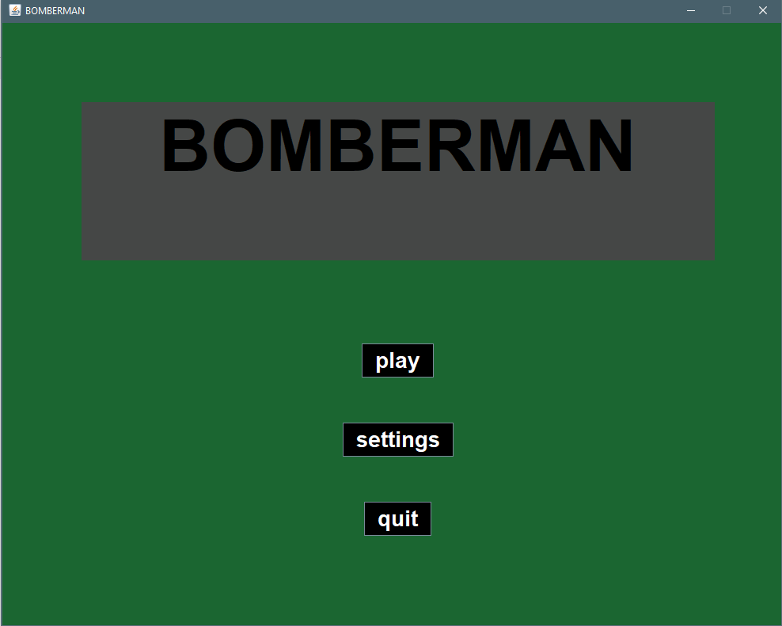
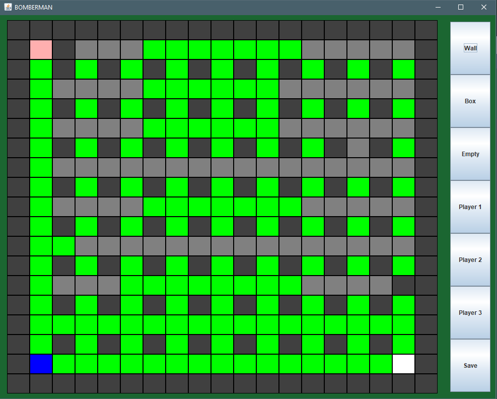
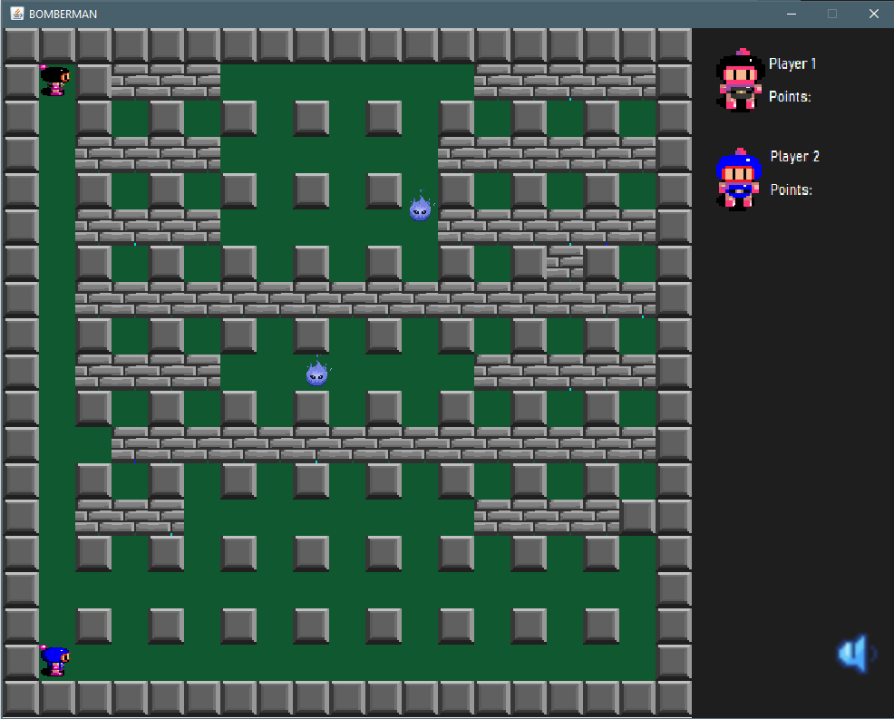

#Lighning

## Name
Bomberman

___
## Description
A bomberman game based on legendary DynaBlaster game.

___
## Usage
In the Bomberman game, players navigate through a grid-like game board filled with obstacles and opponents. The objective is to strategically place bombs in order to destroy these obstacles and defeat opponents, all while avoiding getting caught in the blast radius of the bombs.

At the start of each game, players are given a set number of bombs with a specific blast radius. They must strategically navigate through the game board, placing bombs to clear obstacles and attempt to trap opponents within the blast radius of their bombs.
Players can collect power-ups that appear randomly on the game board after an obstacle has been destroyed. These power-ups can enhance the player's abilities, such as increasing the number of bombs they can place at once, extending the blast radius of their bombs.

Last standing wins round and gets a point, and a the end player with most points wins!

below are some screenshots from game...
___

## In Game Images

___
## Support
For more details, check out the [Wiki page](https://szofttech.inf.elte.hu/software-technology-2024/group-1/lightning/-/wikis/Multiplayer-Bomberman). 

